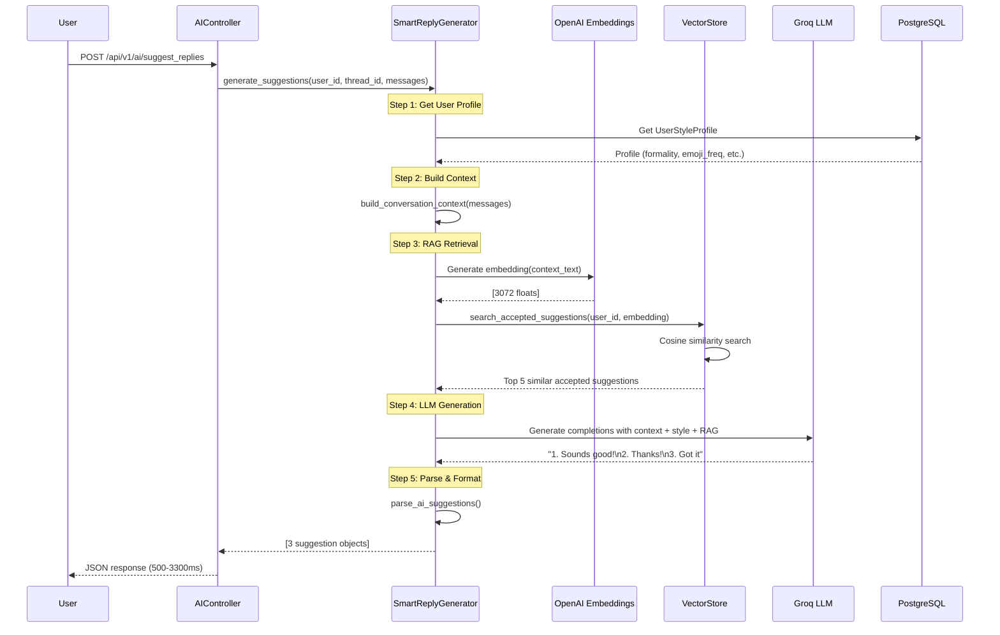
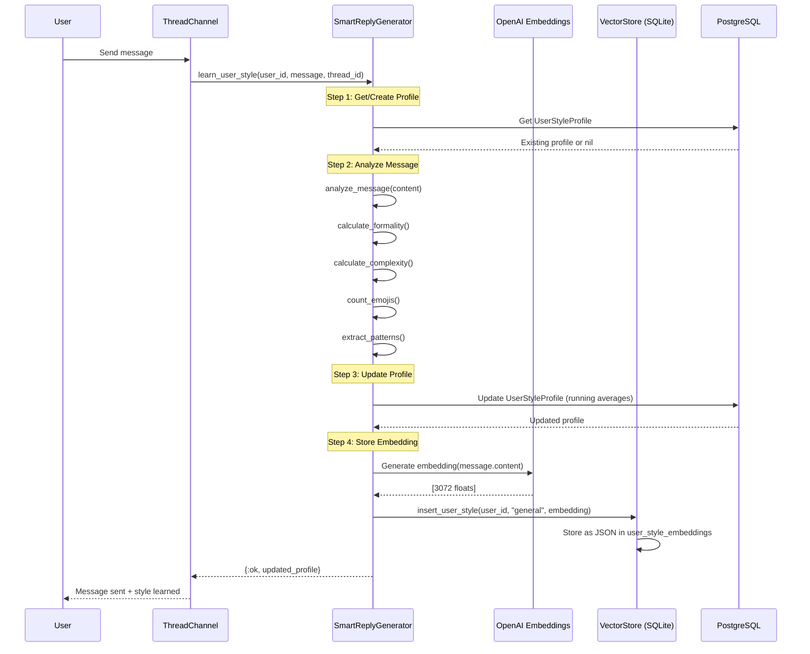
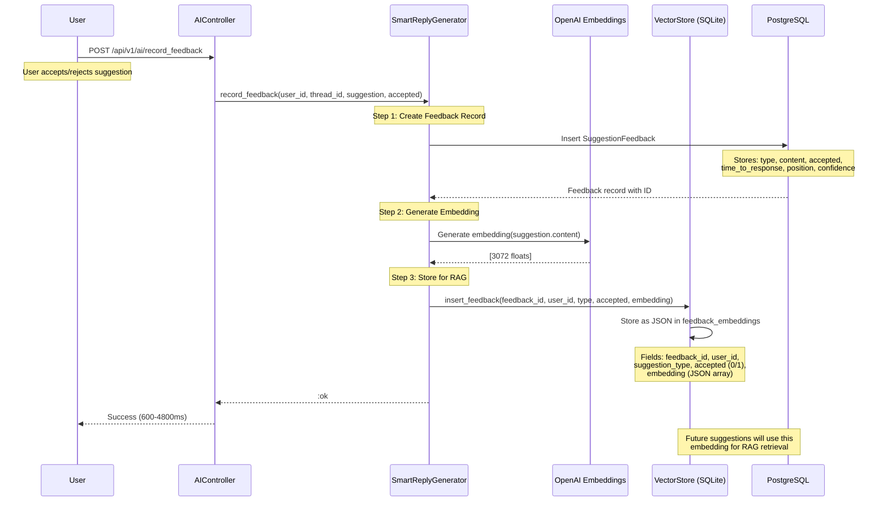
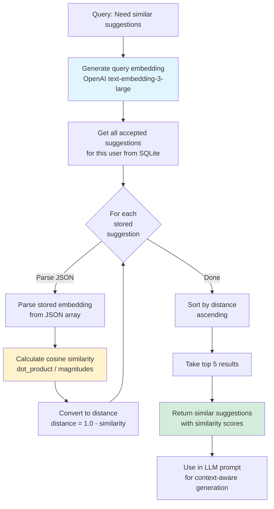
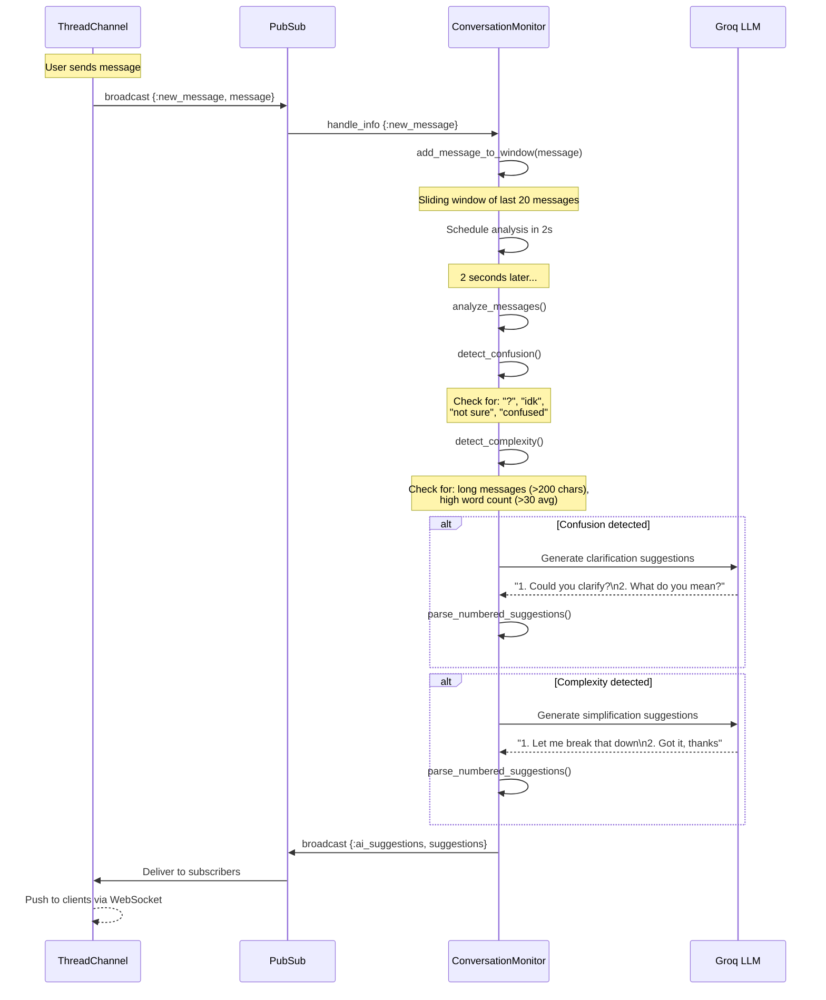
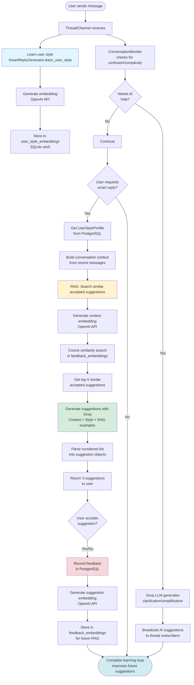
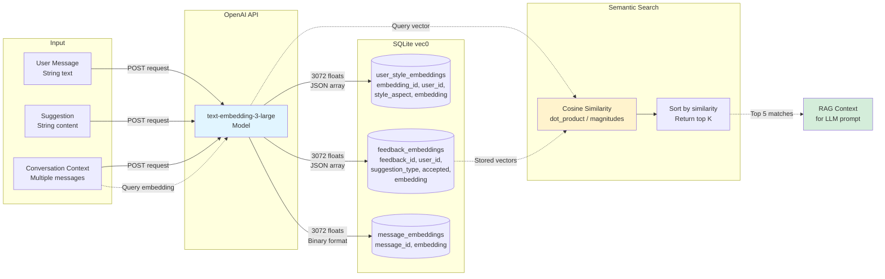
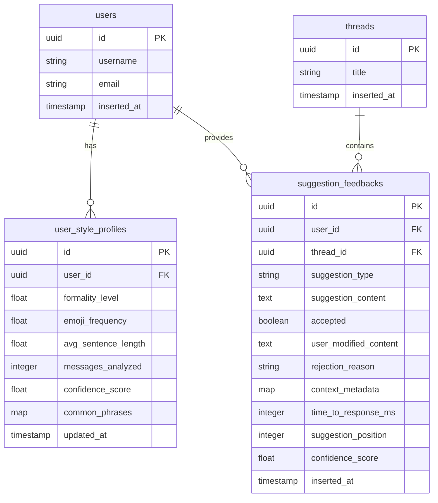

# AI Smart Reply System - Flow Diagrams

## 1. Smart Reply Generation Flow



## 2. User Style Learning Flow



## 3. Feedback Recording & Learning Flow



## 4. RAG Semantic Search Flow



## 5. Conversation Monitor Flow (Real-time AI)



## 6. Complete Workflow - End to End



## 7. Data Flow - Vector Embeddings



## 8. Database Schema - AI Tables



## 9. SQLite Vector Tables (Per-Thread)

```sql
-- Each thread has its own SQLite database with these vec0 tables:

-- Message embeddings (binary format)
CREATE VIRTUAL TABLE message_embeddings USING vec0(
    message_id TEXT PRIMARY KEY,
    embedding float[3072]  -- Binary format
);

-- User style embeddings (JSON format)
CREATE VIRTUAL TABLE user_style_embeddings USING vec0(
    embedding_id TEXT PRIMARY KEY,
    user_id TEXT,
    style_aspect TEXT,  -- "general", "vocabulary", "tone"
    embedding float[3072]  -- JSON array format
);

-- Suggestion feedback embeddings (JSON format)
CREATE VIRTUAL TABLE feedback_embeddings USING vec0(
    feedback_id TEXT PRIMARY KEY,
    user_id TEXT,
    suggestion_type TEXT,  -- "smart_reply", "confusion_clarification"
    accepted INTEGER,  -- 0 or 1
    embedding float[3072]  -- JSON array format
);
```

## Performance Benchmarks

### With Real AI (Current Implementation)
- **Style learning**: 1,480-2,680ms (includes OpenAI embedding)
- **Suggestion generation**: 178-3,333ms (Groq LLM + RAG search)
- **Feedback recording**: 415-4,890ms (includes OpenAI embedding)
- **Total workflow**: 2,569-6,507ms

### API Calls Per Request
- **Smart Reply Generation**: 1-2 OpenAI calls (context + RAG query) + 1 Groq call
- **Style Learning**: 1 OpenAI call per message
- **Feedback Recording**: 1 OpenAI call per feedback

### Cost Estimates
- **OpenAI text-embedding-3-large**: ~$0.13 per 1M tokens
- **Groq llama-3.1-8b-instant**: ~$0.05 per 1M tokens (very fast)
- **Average cost per suggestion**: ~$0.0001-0.0005

## Technical Stack

| Component | Technology | Purpose |
|-----------|-----------|---------|
| Web Framework | Phoenix/Elixir | API endpoints, channels |
| Primary DB | PostgreSQL | User profiles, feedback records |
| Vector DB | SQLite + vec0 | Embeddings, semantic search |
| Embeddings | OpenAI text-embedding-3-large | 3072-dim vectors |
| LLM | Groq llama-3.1-8b-instant | Fast suggestion generation |
| Real-time | Phoenix PubSub | Live AI suggestions |
| Search | Cosine Similarity | Semantic matching |

---

*All diagrams generated for GlobalBridge AI Smart Reply System*
*Real AI implementation - no mocks, no placeholders*
