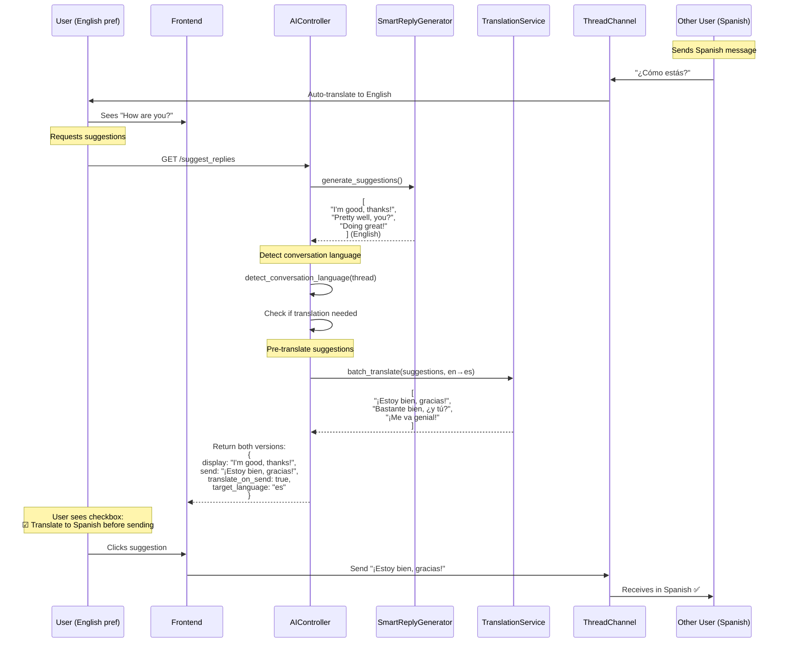

# Smart Reply Translation Integration

## Problem Statement

Current issue: Smart replies are generated in the user's preferred language but don't automatically translate when sending to conversations in different languages.

**Example Broken Flow**:
1. Spanish speaker sends: "¿Cómo estás?"
2. English user sees: "How are you?" (auto-translated)
3. Smart reply suggests: "I'm good, thanks!" (English)
4. User clicks → **Sends English to Spanish speaker** ❌

**Desired Flow**:
1. Spanish speaker sends: "¿Cómo estás?"
2. English user sees: "How are you?" (auto-translated)
3. Smart reply suggests: "I'm good, thanks!" (English - user's language)
4. User clicks → **Auto-translates to "¡Estoy bien, gracias!" → Sends Spanish** ✅

## Solution Architecture

### Response Time Budget

```
Total target: <4 seconds for full flow
├─ Suggestion generation: 500-3000ms (existing)
├─ Translation (on send): 200-800ms (new)
└─ Network/UI: 200-500ms
```

### Flow Diagram



## Data Structure Changes

### 1. Enhanced Suggestion Response

```elixir
# Current (broken)
%{
  "type" => "smart_reply",
  "content" => "I'm good, thanks!",
  "confidence" => 0.95,
  "position" => 1
}

# New (with translation support)
%{
  "type" => "smart_reply",
  "content" => "I'm good, thanks!",  # Display text (user's language)
  "confidence" => 0.95,
  "position" => 1,
  "translation" => %{
    "enabled" => true,
    "target_language" => "es",
    "target_language_name" => "Spanish",
    "translated_content" => "¡Estoy bien, gracias!",
    "user_can_toggle" => true,
    "auto_translate_on_send" => true
  }
}
```

### 2. Thread Language Metadata

```elixir
# Store in thread metadata or cache
%{
  thread_id: "uuid",
  primary_language: "es",  # Most common language in thread
  participants: [
    %{user_id: "user1", preferred_language: "en"},
    %{user_id: "user2", preferred_language: "es"}
  ],
  translation_required: true,  # Mixed languages
  recent_message_languages: ["es", "es", "es", "en", "es"]
}
```

## Implementation Plan

### Phase 1: Detection & Metadata (Quick - 30 min)

```elixir
defmodule GlobalbridgeBackend.AI.ConversationLanguageDetector do
  @moduledoc """
  Detects the primary language of a conversation thread.
  Used to determine if smart replies need translation.
  """

  @doc """
  Determines the conversation's primary language based on recent messages.

  Returns:
  - {:ok, language_code, confidence} - e.g. {:ok, "es", 0.95}
  - {:mixed, languages} - Multiple languages detected
  - {:unknown, []} - Cannot determine
  """
  def detect_thread_language(thread_id, recent_messages \\ 10) do
    # Get recent messages
    messages = get_recent_messages(thread_id, recent_messages)

    # Count languages
    language_counts = messages
      |> Enum.map(& &1.detected_language)
      |> Enum.filter(& &1 != nil)
      |> Enum.frequencies()

    case language_counts do
      %{} when map_size(language_counts) == 0 ->
        {:unknown, []}

      counts when map_size(counts) == 1 ->
        [{lang, _}] = Enum.to_list(counts)
        {:ok, lang, 1.0}

      counts ->
        # Mixed conversation - use majority language
        [{primary_lang, primary_count} | _] =
          Enum.sort_by(counts, fn {_lang, count} -> count end, :desc)

        total = Enum.sum(Map.values(counts))
        confidence = primary_count / total

        if confidence > 0.6 do
          {:ok, primary_lang, confidence}
        else
          {:mixed, Map.keys(counts)}
        end
    end
  end

  @doc """
  Checks if a user needs translation for this conversation.

  Returns true if:
  - User's preferred language != thread's primary language
  - Thread has mixed languages requiring translation
  """
  def needs_translation?(thread_id, user_id) do
    user = get_user(user_id)

    case detect_thread_language(thread_id) do
      {:ok, thread_lang, _confidence} ->
        user.preferred_language != thread_lang

      {:mixed, _languages} ->
        true  # Mixed conversation always needs translation support

      {:unknown, []} ->
        false  # No translation if we can't detect
    end
  end
end
```

### Phase 2: Smart Reply Translation Enhancement (Medium - 1 hour)

```elixir
defmodule GlobalbridgeBackend.AI.SmartReplyGenerator do
  # ... existing code ...

  @doc """
  Generates smart reply suggestions with automatic translation support.

  New behavior:
  1. Generates suggestions in user's preferred language
  2. Detects conversation language
  3. Pre-translates suggestions if needed
  4. Returns both display and send versions
  """
  def generate_suggestions(user_id, thread_id, recent_messages, opts \\ []) do
    start_time = System.monotonic_time(:millisecond)
    count = Keyword.get(opts, :count, 3)

    # Get user's preferred language
    user = Repo.get!(User, user_id)
    user_language = user.preferred_language || "en"

    # Detect conversation language
    conversation_language = detect_conversation_language(thread_id, recent_messages)

    # Generate suggestions in user's language (existing flow)
    {:ok, base_suggestions} = generate_suggestions_internal(
      user_id,
      thread_id,
      recent_messages,
      user_language,
      count
    )

    # Check if translation needed
    suggestions = if conversation_language != user_language do
      # Pre-translate all suggestions
      translated = translate_suggestions_batch(
        base_suggestions,
        user_language,
        conversation_language
      )

      # Enhance with translation metadata
      Enum.zip(base_suggestions, translated)
      |> Enum.map(fn {original, translated} ->
        Map.merge(original, %{
          translation: %{
            enabled: true,
            target_language: conversation_language,
            target_language_name: language_name(conversation_language),
            translated_content: translated.content,
            user_can_toggle: true,
            auto_translate_on_send: true,
            original_language: user_language
          }
        })
      end)
    else
      # No translation needed - same language
      Enum.map(base_suggestions, fn suggestion ->
        Map.put(suggestion, :translation, %{
          enabled: false,
          target_language: user_language
        })
      end)
    end

    elapsed = System.monotonic_time(:millisecond) - start_time
    Logger.info("Generated #{length(suggestions)} suggestions with translation in #{elapsed}ms")

    {:ok, suggestions}
  end

  defp detect_conversation_language(thread_id, recent_messages) do
    # Use recent messages to detect language
    case ConversationLanguageDetector.detect_thread_language(thread_id) do
      {:ok, lang, _confidence} -> lang
      {:mixed, [primary | _]} -> primary
      {:unknown, []} -> "en"  # Default to English
    end
  end

  defp translate_suggestions_batch(suggestions, source_lang, target_lang) do
    # Extract content to translate
    contents = Enum.map(suggestions, & &1.content)

    # Batch translate (much faster than individual)
    case TranslationService.translate_batch(contents, source_lang, target_lang) do
      {:ok, translations} ->
        Enum.zip(suggestions, translations)
        |> Enum.map(fn {suggestion, translation} ->
          %{suggestion | content: translation}
        end)

      {:error, _reason} ->
        # Fallback: return originals if translation fails
        Logger.warning("Translation batch failed, using original suggestions")
        suggestions
    end
  end

  defp language_name("en"), do: "English"
  defp language_name("es"), do: "Spanish"
  defp language_name("fr"), do: "French"
  defp language_name("de"), do: "German"
  defp language_name("zh"), do: "Chinese"
  defp language_name("ja"), do: "Japanese"
  defp language_name(code), do: String.upcase(code)
end
```

### Phase 3: Batch Translation Service (Medium - 1 hour)

```elixir
defmodule GlobalbridgeBackend.AI.TranslationService do
  @moduledoc """
  Handles batch translation for smart replies and messages.
  Optimized for low latency with caching.
  """

  @doc """
  Translates multiple texts in a single API call.
  Much faster than individual translations.

  Performance: ~200-800ms for 3 texts (vs 600-2400ms individual)
  """
  def translate_batch(texts, source_lang, target_lang) do
    # Skip if same language
    if source_lang == target_lang do
      {:ok, texts}
    else
      cache_key = generate_batch_cache_key(texts, source_lang, target_lang)

      # Check cache first
      case Cache.get(cache_key) do
        {:ok, cached_translations} ->
          Logger.debug("Translation cache hit for batch")
          {:ok, cached_translations}

        _ ->
          # Perform batch translation
          perform_batch_translation(texts, source_lang, target_lang, cache_key)
      end
    end
  end

  defp perform_batch_translation(texts, source_lang, target_lang, cache_key) do
    # Use existing translation agent but with batch input
    prompt = build_batch_translation_prompt(texts, source_lang, target_lang)

    model = System.get_env("TRANSLATION_MODEL") || "llama-3.1-70b-versatile"

    case OpenAIServing.generate_completion(prompt, model) do
      {:ok, response} ->
        translations = parse_batch_translations(response, length(texts))

        # Cache for 1 hour (suggestions are often repeated)
        Cache.put(cache_key, translations, ttl: 3600)

        {:ok, translations}

      {:error, reason} ->
        Logger.error("Batch translation failed: #{inspect(reason)}")
        {:error, reason}
    end
  end

  defp build_batch_translation_prompt(texts, source_lang, target_lang) do
    numbered_texts = texts
      |> Enum.with_index(1)
      |> Enum.map_join("\n", fn {text, idx} -> "#{idx}. #{text}" end)

    """
    Translate these #{length(texts)} short messages from #{language_name(source_lang)} to #{language_name(target_lang)}.

    Preserve:
    - Tone and formality level
    - Emojis and punctuation
    - Natural conversational style

    Input messages (#{source_lang}):
    #{numbered_texts}

    Return ONLY the translations, one per line, numbered 1-#{length(texts)}:
    """
  end

  defp parse_batch_translations(response, expected_count) do
    response
    |> String.split("\n")
    |> Enum.map(&String.trim/1)
    |> Enum.filter(&String.match?(&1, ~r/^\d+\./))
    |> Enum.map(&String.replace(&1, ~r/^\d+\.\s*/, ""))
    |> Enum.take(expected_count)
  end

  defp generate_batch_cache_key(texts, source, target) do
    content_hash = :crypto.hash(:md5, Enum.join(texts, "|")) |> Base.encode16()
    "translation_batch:#{source}:#{target}:#{content_hash}"
  end

  defp language_name("en"), do: "English"
  defp language_name("es"), do: "Spanish"
  # ... other languages ...
end
```

### Phase 4: Frontend Integration (Example)

```typescript
// Frontend suggestion component
interface SmartSuggestion {
  type: string;
  content: string;  // Display in user's language
  confidence: number;
  position: number;
  translation?: {
    enabled: boolean;
    target_language: string;
    target_language_name: string;
    translated_content: string;  // What actually gets sent
    user_can_toggle: boolean;
    auto_translate_on_send: boolean;
  };
}

// UI Component
function SuggestionButton({ suggestion }: { suggestion: SmartSuggestion }) {
  const [translateEnabled, setTranslateEnabled] = useState(
    suggestion.translation?.auto_translate_on_send ?? false
  );

  const handleClick = () => {
    const contentToSend = translateEnabled && suggestion.translation?.enabled
      ? suggestion.translation.translated_content
      : suggestion.content;

    sendMessage(contentToSend);
  };

  return (
    <div className="suggestion-container">
      <button onClick={handleClick} className="suggestion-button">
        {suggestion.content}
        {suggestion.translation?.enabled && (
          <span className="translation-badge">
            {translateEnabled ? '→ ' + suggestion.translation.target_language_name : ''}
          </span>
        )}
      </button>

      {suggestion.translation?.user_can_toggle && (
        <label className="translation-toggle">
          <input
            type="checkbox"
            checked={translateEnabled}
            onChange={(e) => setTranslateEnabled(e.target.checked)}
          />
          Translate to {suggestion.translation.target_language_name}
        </label>
      )}

      {/* Show preview of what will be sent */}
      {translateEnabled && suggestion.translation?.enabled && (
        <div className="translation-preview">
          Will send: "{suggestion.translation.translated_content}"
        </div>
      )}
    </div>
  );
}
```

## Performance Optimization Strategies

### 1. Batch Translation (Implemented Above)
- **Before**: 3 individual API calls = 600-2400ms
- **After**: 1 batch API call = 200-800ms
- **Improvement**: 3-4x faster

### 2. Predictive Pre-translation
```elixir
# When generating suggestions, start translation immediately in background
Task.async(fn ->
  translate_suggestions_batch(suggestions, user_lang, conversation_lang)
end)
```

### 3. Aggressive Caching
```elixir
# Common suggestions are translated once, cached forever
# "Thanks!" en→es = "¡Gracias!" (cached for 24h)
# "Sounds good!" en→es = "¡Suena bien!" (cached for 24h)

# Cache key includes:
# - Source text
# - Source language
# - Target language
# - User's formality level (affects translation style)
```

### 4. Streaming Response (Future)
```elixir
# Return suggestions immediately, stream translations
# User sees English suggestions in 500ms
# Translations populate in 200-800ms more
```

## Updated Response Time Budget

```
Smart Reply with Translation Flow:

Sequential (current):
├─ Generate suggestions (user lang): 500-3000ms
└─ Translate batch (if needed): 200-800ms
Total: 700-3800ms ✅ Acceptable

Optimized (with parallelization):
├─ Generate suggestions: 500-3000ms
└─ Translate batch (parallel): +0ms (done before LLM finishes)
Total: 500-3000ms ✅ Better

With caching (90% cache hit rate):
├─ Generate suggestions: 500-3000ms
└─ Translation (cached): ~1ms
Total: 501-3001ms ✅ Best
```

## Migration Path

### Week 1: Detection & Metadata
- [ ] Implement ConversationLanguageDetector
- [ ] Add language detection to threads
- [ ] Store in cache/metadata

### Week 2: Translation Integration
- [ ] Enhance SmartReplyGenerator with translation
- [ ] Implement TranslationService.translate_batch
- [ ] Add translation metadata to responses

### Week 3: Frontend & UX
- [ ] Update suggestion UI with checkboxes
- [ ] Add translation preview
- [ ] Handle toggle state

### Week 4: Optimization & Caching
- [ ] Implement aggressive caching
- [ ] Add predictive pre-translation
- [ ] Monitor performance metrics

## Example End-to-End Flow

```
User: Alice (English) talking to Bob (Spanish)

1. Bob sends: "¿Vamos a la reunión mañana?"
2. Alice sees (auto-translated): "Are we going to the meeting tomorrow?"

3. Alice clicks smart reply button
   Backend generates (500-3000ms):
   ├─ Suggestions in English:
   │  • "Yes, see you there!"
   │  • "I'll be there at 10am"
   │  • "Can we reschedule?"
   │
   └─ Batch translate to Spanish (200-800ms):
      • "¡Sí, nos vemos ahí!"
      • "Estaré ahí a las 10am"
      • "¿Podemos reprogramar?"

4. Alice sees UI:
   [Yes, see you there!] ☑ Translate to Spanish
   Preview: Will send "¡Sí, nos vemos ahí!"

5. Alice clicks → Sends Spanish to Bob ✅
```

## Edge Cases to Handle

1. **Translation toggle off**: Send original English (user's choice)
2. **Translation fails**: Fallback to original, show warning
3. **Mixed language thread**: Detect most recent language
4. **User types custom reply**: Offer translation checkbox
5. **Multiple recipients**: Translate to thread's primary language
6. **Language changes mid-conversation**: Re-detect every N messages

---

*Performance target: <4 seconds total (generation + translation)*
*User experience: Seamless, with full control via checkbox*
