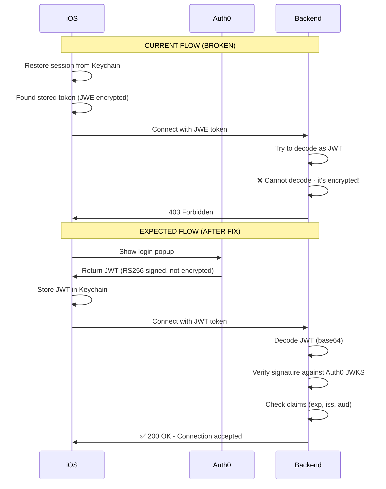

# 🔴 CRITICAL: JWE (Encrypted Token) vs JWT Issue

## Problem Summary

Your iOS app is receiving a **JWE (JSON Web Encryption)** token from Auth0, but your Phoenix backend expects a **JWT (JSON Web Token)** that it can decode and verify. The backend cannot decrypt JWE tokens, causing 403 Forbidden errors.

---

## Evidence from Your Logs

```
✅ [AUTH] Session restored for user: auth0|68ed8a33262e564977c4a95b
   Token format: JWT (3 parts) ✅  ← iOS code incorrectly identifies as JWT

📊 [PHOENIX] Token being sent to backend:
   - Parts count: 4 (JWT=3, JWE=5)  ← Actually 4-5 parts = JWE!
   - First part: eyJhbGciOiJkaXIiLCJlbmMiOiJBMjU2R0NNIiwiaXNzIjoiaH...

Decoded first part:
{
  "alg": "dir",           ← Direct encryption (JWE)
  "enc": "A256GCM",       ← AES-256-GCM encryption
  "iss": "https://dev-1672riu03fjuf7so.us.auth0.com/"
}

Backend Response:
Status Code: 403 Forbidden  ← Cannot decrypt/verify
```

---

## Token Format Comparison

### JWT (JSON Web Token) - What Backend Expects
```
eyJhbGci...  .  eyJzdWIi...  .  SflKxw...
   ↑              ↑              ↑
 Header         Payload      Signature
(readable)    (readable)   (verify only)

Structure: 3 parts separated by dots
Header example:
{
  "alg": "RS256",      ← Signed with RSA
  "typ": "JWT"
}

Can decode payload without keys:
{
  "sub": "auth0|123",
  "aud": "globalbridge-api",
  "exp": 1234567890
}
```

### JWE (JSON Web Encryption) - What iOS Is Receiving
```
eyJhbGci...  .  (empty)  .  hM2nvv...  .  lF46Td...  .  OmlVOt...
   ↑              ↑          ↑            ↑            ↑
 Header      Encrypted    Init       Encrypted      Auth
(readable)     Key        Vector     Content        Tag

Structure: 5 parts (sometimes 4 if key is empty)
Header example:
{
  "alg": "dir",        ← Direct key encryption
  "enc": "A256GCM",    ← Content encrypted with AES-256-GCM
  "iss": "https://dev-1672riu03fjuf7so.us.auth0.com/"
}

Cannot decode payload without decryption key:
The entire payload is encrypted and unreadable!
```

---

## Why This Is Happening

### Possible Causes:

1. **Auth0 Application Settings**
   - ID Token encryption is enabled in Auth0
   - Application settings → Advanced → ID Token Encryption

2. **iOS SDK Configuration**
   - Requesting encrypted tokens
   - Using wrong token type (ID token instead of access token)

3. **Backend Configuration Mismatch**
   - Backend expects JWT but can't handle JWE
   - No decryption capability configured

---

## Impact

- ✅ iOS can store and retrieve token from Keychain
- ✅ iOS thinks it has a valid session
- ❌ Backend cannot decrypt/verify the JWE token
- ❌ WebSocket connection fails with 403 Forbidden
- ❌ User cannot access any data from backend
- ❌ App appears stuck in loading state

---

## Fix Options

### Option 1: Disable Token Encryption in Auth0 (RECOMMENDED)

**Why:** Encryption is usually unnecessary for mobile apps since:
- Tokens are already transmitted over TLS/HTTPS
- Tokens are stored securely in iOS Keychain
- Standard JWT signatures provide integrity verification

**How:**
1. Go to Auth0 Dashboard
2. Applications → GlobalBridge iOS App
3. Settings → Advanced Settings
4. Scroll to "ID Token Encryption"
5. **Disable** ID token encryption
6. Save changes
7. Delete iOS app and reinstall (to clear old encrypted token)

**Expected Result:**
```
Token header will be:
{
  "alg": "RS256",     ← Signed, not encrypted
  "typ": "JWT",
  "kid": "abc123"
}

Backend can decode and verify ✅
```

---

### Option 2: Add JWE Decryption to Backend (Complex)

**Why:** Only needed if encryption is required by security policy

**How:**
```elixir
# Add JOSE or Joken library for JWE
# mix.exs
defp deps do
  [
    {:jose, "~> 1.11"},
    # ... other deps
  ]
end

# auth0_verifier.ex
defp decrypt_jwe_token(jwe_token) do
  # Need encryption key from Auth0
  jwk = %{
    "kty" => "oct",
    "k" => Application.get_env(:globalbridge_backend, :auth0_encryption_key)
  }

  case JOSE.JWE.expand(jwe_token) do
    {:ok, jwe} ->
      {payload, _jwe} = JOSE.JWE.block_decrypt(jwk, jwe)
      # Now decode the decrypted JWT payload
      Jason.decode(payload)

    error ->
      {:error, :decryption_failed}
  end
end
```

**Challenges:**
- Need to obtain encryption key from Auth0
- More complex to maintain
- Performance overhead
- Not standard for mobile apps

---

### Option 3: Use Access Token Instead of ID Token

**Why:** Access tokens might not be encrypted

**iOS Changes:**
```swift
// AuthManager.swift - Verify which token is being used

func getAccessToken() async -> String? {
    // Make sure returning ACCESS token, not ID token
    if needsRefresh() {
        try await refreshToken()
    }

    // Return access token (for API calls)
    return accessToken  // ← Not idToken!
}
```

**Check Token Type:**
```swift
// In login success handler
let credentials = try await Auth0.webAuth(...).start()

print("🔍 Access Token: \(credentials.accessToken)")
print("🔍 ID Token: \(credentials.idToken)")

// Backend should use accessToken for authorization
// ID token is just for user info
```

---

## Verification Steps

### 1. Check Current Token Type
```bash
# Copy your token from iOS logs (the long string)
TOKEN="eyJhbGci..."

# Count the dots
echo "$TOKEN" | grep -o '\.' | wc -l

# Result:
# 2 dots = 3 parts = JWT ✅
# 4 dots = 5 parts = JWE ❌
```

### 2. Decode Token Header
```bash
# Extract first part
HEADER=$(echo "$TOKEN" | cut -d'.' -f1)

# Decode (add padding if needed)
echo "$HEADER=" | base64 -d 2>/dev/null | jq '.'

# If you see "enc" field → JWE ❌
# If you see "typ": "JWT" → JWT ✅
```

### 3. Check Auth0 Configuration
```
1. Go to: https://manage.auth0.com/dashboard
2. Applications → Your iOS App
3. Settings → Advanced Settings
4. Look for "ID Token Encryption"
5. Should be DISABLED for mobile apps
```

### 4. Test After Fix
```
After disabling encryption:
1. Delete iOS app
2. Reinstall from Xcode
3. Login with Auth0 (popup should appear)
4. Check logs for JWT header:
   {"alg":"RS256","typ":"JWT"}  ✅
5. Backend should accept connection ✅
```

---

## Why No Auth0 Popup?

You mentioned "Auth0 is never popping up on the iOS client" - this is because:

```swift
✅ [AUTH] Session restored for user: auth0|68ed8a33262e564977c4a95b
```

**The app is restoring a previous session from Keychain!**

It's not showing the Auth0 login because it thinks you're already logged in (has a stored token). The problem is that stored token is a JWE that the backend can't handle.

**To force a new login:**
```swift
// AuthManager.swift
func logout() {
    // Clear Keychain
    credentialsManager.clear()

    // Clear in-memory state
    accessToken = nil
    refreshToken = nil
    userId = nil
    isAuthenticated = false

    print("🚪 Logged out successfully")
}

// Call logout, then login again to see Auth0 popup
```

---

## Recommended Action Plan

### Step 1: Verify Token Type (5 minutes)
```bash
# From iOS logs, copy the token and check:
echo "YOUR_TOKEN" | awk -F'.' '{print NF-1" dots = "(NF)" parts"}'

# Decode first part to see if JWE:
echo "YOUR_TOKEN" | cut -d'.' -f1 | base64 -d | jq '.'
```

### Step 2: Disable Encryption in Auth0 (5 minutes)
- Dashboard → Applications → Settings → Advanced
- Disable "ID Token Encryption"
- Save changes

### Step 3: Clear iOS App and Re-login (2 minutes)
```swift
// Add logout button to iOS app
// Call AuthManager.shared.logout()
// Then call AuthManager.shared.login()
// Auth0 popup should appear this time
```

### Step 4: Verify Connection (2 minutes)
- Check logs for JWT header: `{"alg":"RS256","typ":"JWT"}`
- Backend should return 200 OK instead of 403
- WebSocket connection established ✅

**Total Time: ~15 minutes to fix**

---

## Updated Mermaid Diagram: Current vs Expected Flow



---

## Summary

**Current State:**
- Token Type: JWE (encrypted)
- Parts: 4-5 (should be 3 for JWT)
- Backend: Cannot decrypt → 403 Forbidden
- User Experience: Stuck, no data loading

**After Fix:**
- Token Type: JWT (signed)
- Parts: 3
- Backend: Can decode and verify → 200 OK
- User Experience: Works correctly ✅

**Action:** Disable ID token encryption in Auth0 Dashboard (5 minutes)

---

**Last Updated:** 2025-01-23
**Issue Type:** Token Format Mismatch (JWE vs JWT)
**Severity:** Critical (Blocks all authentication)
**Fix Complexity:** Low (Just a config change in Auth0)
