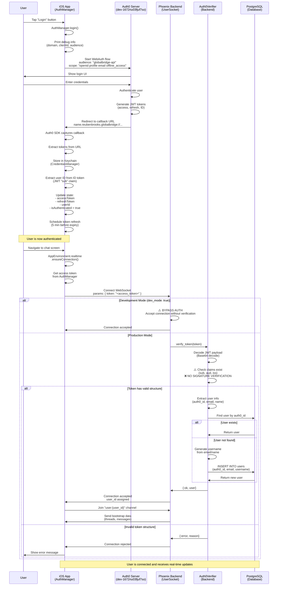
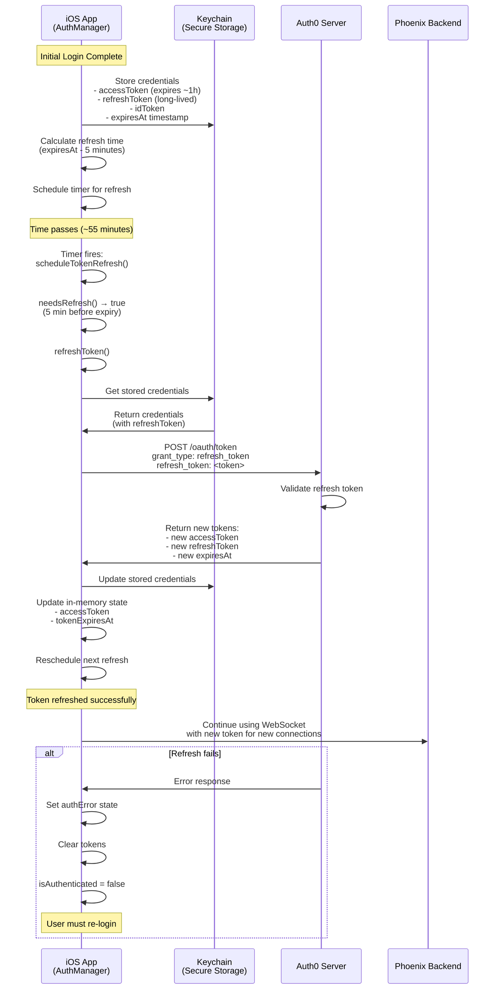
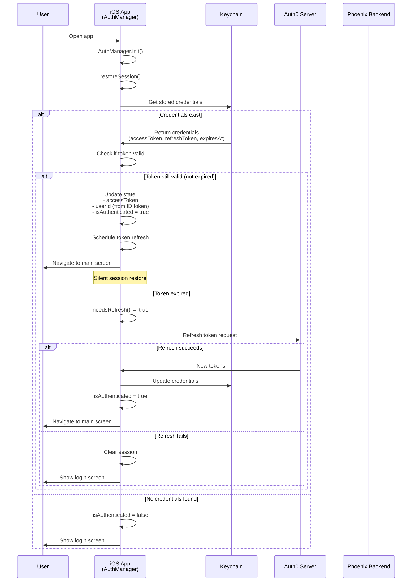
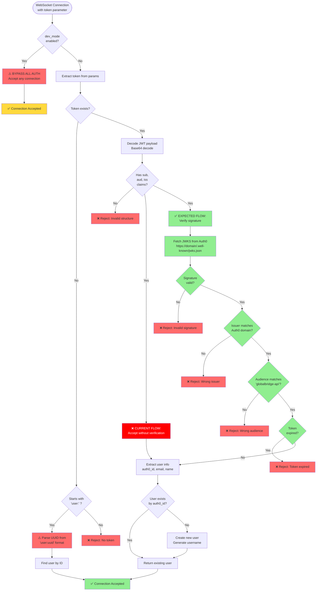
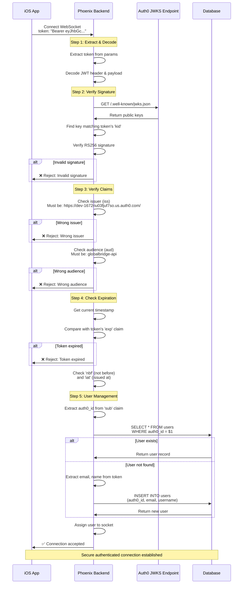

# Auth0 Integration - Complete Diagram Collection

This document contains comprehensive Mermaid diagrams documenting the WhatsApp clone's Auth0 authentication system, including current implementation, identified issues, and recommended fixes.

---

## 1. Complete Authentication Flow (iOS → Auth0 → Phoenix)



---

## 2. Token Lifecycle and Refresh Flow



---

## 3. Session Restoration Flow (App Restart)



---

## 4. Critical Security Issues Identified

```mermaid
graph TD
    A[Authentication System] --> B[iOS Client]
    A --> C[Auth0 Service]
    A --> D[Phoenix Backend]

    B --> B1[✅ Good: Token Storage]
    B --> B2[✅ Good: Auto-Refresh]
    B --> B3[❌ Issue: Hardcoded Credentials]
    B --> B4[⚠️ Issue: Sync Token Access in FeatureFlags]

    C --> C1[✅ Good: OAuth2 Flow]
    C --> C2[✅ Good: Token Generation]
    C --> C3[⚠️ Warning: Development Domain]

    D --> D1[❌ CRITICAL: No Signature Verification]
    D --> D2[❌ CRITICAL: No Expiration Check]
    D --> D3[❌ CRITICAL: Dev Mode Bypass]
    D --> D4[❌ HIGH: Simple Token Fallback]
    D --> D5[❌ HIGH: Secrets in Git]
    D --> D6[⚠️ MEDIUM: Duplicate User Logic]
    D --> D7[⚠️ MEDIUM: No Token Refresh]

    style B1 fill:#90EE90
    style B2 fill:#90EE90
    style C1 fill:#90EE90
    style C2 fill:#90EE90
    style B3 fill:#FF6B6B
    style B4 fill:#FFD93D
    style C3 fill:#FFD93D
    style D1 fill:#FF0000,color:#FFFFFF
    style D2 fill:#FF0000,color:#FFFFFF
    style D3 fill:#FF0000,color:#FFFFFF
    style D4 fill:#FF6B6B
    style D5 fill:#FF6B6B
    style D6 fill:#FFD93D
    style D7 fill:#FFD93D
```



---

## 5. Backend Token Verification Flow (Current vs Expected)



---

## 6. Configuration Issues Across Platforms

```mermaid
graph TD
    Auth0Config[Auth0 Configuration] --> iOS[iOS Native]
    Auth0Config --> Expo[Expo/React Native]
    Auth0Config --> Backend[Phoenix Backend]
    Auth0Config --> Docs[Documentation]

    iOS --> iOS1[Domain: dev-1672riu03fjuf7so.us.auth0.com]
    iOS --> iOS2[Client ID: id5kQQRxJtDhIQ10C9r6TGKmnu0FwIcj]
    iOS --> iOS3[✅ Audience: globalbridge-api]
    iOS --> iOS4[❌ Credentials Hardcoded]
    iOS --> iOS5[✅ URL Scheme: name.reubenbrooks.globalbridge]

    Expo --> Expo1[Domain: dev-1672riu03fjuf7so.us.auth0.com]
    Expo --> Expo2[Client ID: (from EXPO_PUBLIC_AUTH0_CLIENT_ID)]
    Expo --> Expo3[❌ Audience: https://globalbridge-api]
    Expo --> Expo4[✅ Reads from .env]

    Backend --> Back1[Domain: (from AUTH0_DOMAIN)]
    Backend --> Back2[✅ Audience: globalbridge-api]
    Backend --> Back3[❌ Secrets in .env (committed)]
    Backend --> Back4[❌ dev_mode: true]
    Backend --> Back5[❌ No signature verification]

    Docs --> Docs1[❌ AUTH0_ENV_SETUP: https://api.globalbridge.dev]
    Docs --> Docs2[❌ Multiple inconsistent audience values]
    Docs --> Docs3[✅ AUTH0_INTEGRATION_GUIDE: Accurate]

    style iOS3 fill:#90EE90
    style iOS5 fill:#90EE90
    style iOS4 fill:#FF6B6B
    style Expo4 fill:#90EE90
    style Expo3 fill:#FF6B6B
    style Back2 fill:#90EE90
    style Back3 fill:#FF0000,color:#FFFFFF
    style Back4 fill:#FF0000,color:#FFFFFF
    style Back5 fill:#FF0000,color:#FFFFFF
    style Docs1 fill:#FF6B6B
    style Docs2 fill:#FF6B6B
    style Docs3 fill:#90EE90
```

---

## 7. Attack Vectors (Current Vulnerabilities)

```mermaid
flowchart TD
    Attacker[🎭 Attacker] --> Vector1[Vector 1: Forged JWT]
    Attacker --> Vector2[Vector 2: Simple Token]
    Attacker --> Vector3[Vector 3: Dev Mode]
    Attacker --> Vector4[Vector 4: Expired Token]

    Vector1 --> V1Step1[Create fake JWT with:<br/>- sub: 'auth0|victim_id'<br/>- aud: 'globalbridge-api'<br/>- iss: 'https://dev-1672riu03fjuf7so.us.auth0.com/']
    V1Step1 --> V1Step2[❌ Backend accepts without<br/>signature verification]
    V1Step2 --> V1Result[🚨 Attacker impersonates<br/>any user]

    Vector2 --> V2Step1[Create simple token:<br/>'user:00000000-0000-0000-0000-000000000001']
    V2Step1 --> V2Step2[❌ Backend accepts<br/>simple token fallback]
    V2Step2 --> V2Result[🚨 Attacker accesses<br/>account by UUID]

    Vector3 --> V3Step1[Connect without token<br/>when dev_mode: true]
    V3Step1 --> V3Step2[❌ Backend bypasses<br/>all authentication]
    V3Step2 --> V3Result[🚨 Anyone can connect<br/>without credentials]

    Vector4 --> V4Step1[Use token expired<br/>6 months ago]
    V4Step1 --> V4Step2[❌ Backend doesn't<br/>check exp claim]
    V4Step2 --> V4Result[🚨 Stolen tokens work<br/>indefinitely]

    style V1Result fill:#FF0000,color:#FFFFFF
    style V2Result fill:#FF0000,color:#FFFFFF
    style V3Result fill:#FF0000,color:#FFFFFF
    style V4Result fill:#FF0000,color:#FFFFFF
    style V1Step2 fill:#FF6B6B
    style V2Step2 fill:#FF6B6B
    style V3Step2 fill:#FF6B6B
    style V4Step2 fill:#FF6B6B
```

---

## 8. Recommended Secure Flow Implementation



---

## 9. Priority Fixes Roadmap

```mermaid
gantt
    title Authentication Security Fixes Roadmap
    dateFormat YYYY-MM-DD
    section Critical (Week 1)
    Implement JWT signature verification :crit, a1, 2025-01-01, 2d
    Add expiration claim checking :crit, a2, after a1, 1d
    Remove dev_mode bypass in production :crit, a3, after a1, 1d
    Rotate Auth0 client secret :crit, a4, after a1, 1d
    Add .env to .gitignore :crit, a5, after a1, 1d

    section High Priority (Week 2)
    Move iOS credentials to config :high, b1, 2025-01-05, 2d
    Fix Expo audience configuration :high, b2, 2025-01-05, 1d
    Update documentation consistency :high, b3, 2025-01-06, 2d
    Fix FeatureFlags async token access :high, b4, 2025-01-07, 1d

    section Medium Priority (Week 3)
    Add comprehensive error logging :medium, c1, 2025-01-10, 2d
    Implement token refresh on backend :medium, c2, 2025-01-12, 2d
    Add session restoration UI feedback :medium, c3, 2025-01-12, 1d
    Remove duplicate user creation logic :medium, c4, 2025-01-13, 1d

    section Testing & Validation (Week 4)
    Security audit & penetration testing :test, d1, 2025-01-15, 3d
    Integration testing :test, d2, 2025-01-17, 2d
    Load testing with token refresh :test, d3, 2025-01-18, 1d
    Documentation review :test, d4, 2025-01-19, 1d
```

---

## 10. System Architecture Overview

```mermaid
graph TB
    subgraph "Client Layer"
        iOSApp[iOS Native App<br/>Swift/SwiftUI]
        ExpoApp[Expo App<br/>React Native]
    end

    subgraph "Authentication Provider"
        Auth0[Auth0 Service<br/>dev-1672riu03fjuf7so.us.auth0.com]
        JWKS[JWKS Endpoint<br/>Public Keys]
    end

    subgraph "Backend Layer"
        Phoenix[Phoenix WebSocket<br/>UserSocket.ex]
        Verifier[Auth0Verifier<br/>Token Validation]
        Guardian[Guardian<br/>Session Management]
    end

    subgraph "Data Layer"
        PostgreSQL[(PostgreSQL<br/>Users, Threads, Messages)]
        Keychain[(iOS Keychain<br/>Secure Token Storage)]
    end

    iOSApp -->|1. Login Request| Auth0
    ExpoApp -->|1. Login Request| Auth0
    Auth0 -->|2. JWT Tokens| iOSApp
    Auth0 -->|2. JWT Tokens| ExpoApp

    iOSApp -->|3. Store Tokens| Keychain
    iOSApp -->|4. WebSocket + Token| Phoenix
    ExpoApp -->|4. WebSocket + Token| Phoenix

    Phoenix -->|5. Verify Token| Verifier
    Verifier -.->|❌ Should Verify<br/>(Currently Missing)| JWKS
    Verifier -->|6. Get/Create User| PostgreSQL

    Phoenix -->|7. Session Management| Guardian
    Guardian -->|Store Sessions| PostgreSQL

    Phoenix -->|8. Real-time Updates| iOSApp
    Phoenix -->|8. Real-time Updates| ExpoApp

    style Auth0 fill:#635DFF
    style JWKS fill:#635DFF
    style Phoenix fill:#4E2A84
    style Verifier fill:#FF6B6B
    style PostgreSQL fill:#336791
    style Keychain fill:#90EE90
```

---

## Summary of Issues

### 🔴 CRITICAL (Must Fix Before Production)
1. **No JWT Signature Verification** - Attacker can forge tokens
2. **No Token Expiration Check** - Expired tokens accepted indefinitely
3. **Dev Mode Bypass** - Authentication completely bypassed if enabled
4. **Secrets in Git** - `AUTH0_CLIENT_SECRET` exposed in repository

### 🟠 HIGH PRIORITY
5. **Simple Token Fallback** - "user:uuid" format bypasses Auth0
6. **Hardcoded iOS Credentials** - Should use config files
7. **Audience Mismatch** - Expo config has wrong audience format

### 🟡 MEDIUM PRIORITY
8. **Duplicate User Creation Logic** - Race condition potential
9. **No Backend Token Refresh** - Cannot refresh Auth0 tokens
10. **FeatureFlags Sync Access** - Should use async/await pattern

### Next Steps
1. Implement JWT signature verification using JWKS
2. Add claim validation (exp, iss, aud)
3. Disable dev_mode in production config
4. Move secrets to environment variables
5. Standardize audience configuration across all platforms
